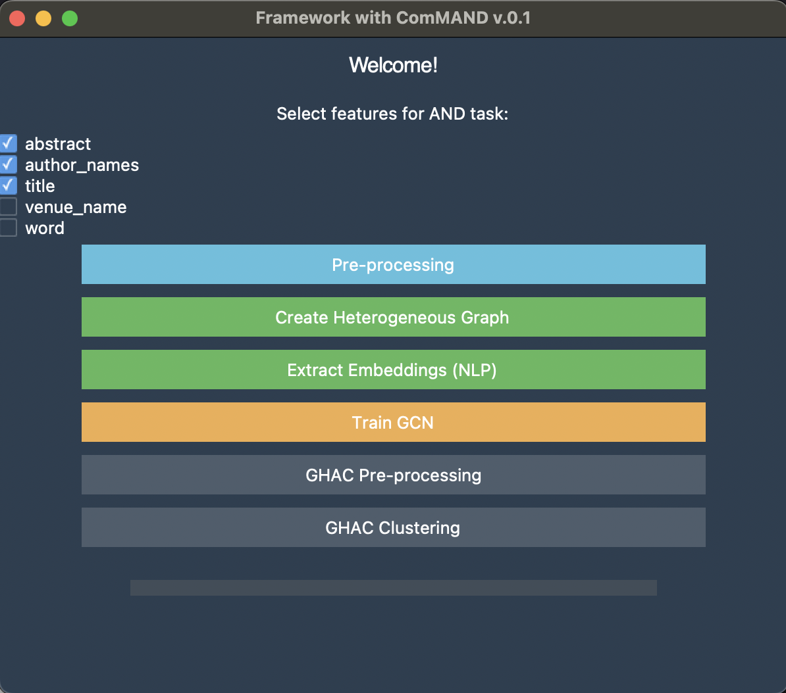

# ComMAND: A Combined Method for Author Name Disambiguation

This work presents a framework with ComMAND for Author Name Disambiguation (AND). It combines transfer learning using SciBERT-based embeddings, constructing a heterogeneous graph, and learning with Graph Convolutional Networks (GCN) and Graph-enhanced Hierarchical Agglomerative Clustering (GHAC) clustering. The framework is accessible via a Graphical User Interface (GUI).

## GUI

The framework includes a GUI that allows users to run the full pipeline without coding. Users can select features, run preprocessing, extract embeddings, create graphs, and apply GCN and GHAC models step by step.


<p align="center">
  
</p>


## Project Structure

```
├── data_process/
│   ├── pre_processing.py
│   └── pre_process_ghac.py
├── datasets/                    # Input and processed data
├── gcn/
│   └── embedding_extraction_gcn.py
├── ghac/
│   └── ghac.py
├── het_network/
│   └── network_creation.py
├── nlp/
│   └── nlp.py
├── gui.py                       # Main GUI script
└── README.md
```

## Modules Overview

- **Pre-processing**: Filters input JSONs by selected features.
- **NLP**: Extracts contextual embeddings using SciBERT (`allenai/scibert_scivocab_uncased`).
- **Graph Construction**: Builds a heterogeneous graph including papers, authors, abstracts, venues, and keywords.
- **GCN**: Learns refined node embeddings from the graph structure.
- **GHAC**: Clusters documents into authors and evaluates results using standard AND metrics.

## Dependencies and Installation

We recommend using **Python 3.10+**. To install dependencies:

- PyTorch
- PyTorch Geometric
- HuggingFace Transformers
- scikit-learn
- ttkbootstrap
- tqdm
- pandas
- networkx


```bash
git clone https://anonymous.4open.science/r/ComMAND-CD68.git
cd ComMAND
pip install -r requirements.txt
```


## Running the Application


To start the GUI:

```bash
python gui.py
```

The interface supports:
- Feature selection
- Pre-processing
- Embedding extraction
- Graph construction
- GCN training
- GHAC clustering and evaluation


The framework is compatible with standard AND datasets, including:
- **AMiner-12**
- **AMiner-18**
- **DBLP**

Sample datasets are provided in compressed format inside the `datasets/` directory for testing purposes.


The `datasets/` directory should contain structured JSON files with fields like:
```json
{
  "id": "doc1",
  "title": "...",
  "abstract": "...",
  "venue": "...",
  "coauthors": ["..."],
  "keywords": ["..."],
  "label": "real_author_id"
}
```


## Notes

- Evaluation includes Pairwise Precision, Recall, F1-score, ACP, AAP, and K-Metric.
